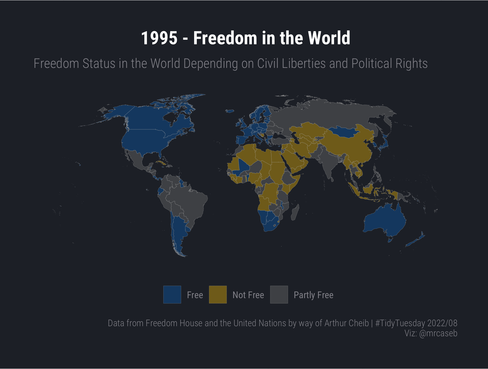

Freedom in the World - TidyTuesday
================
Sebastian Carl
2022-02-23 11:22:53

# TidyTuesday

Join the R4DS Online Learning Community in the weekly \#TidyTuesday
event! Every week we post a raw dataset, a chart or article related to
that dataset, and ask you to explore the data. While the dataset will be
“tamed”, it will not always be tidy! As such you might need to apply
various R for Data Science techniques to wrangle the data into a true
tidy format. The goal of TidyTuesday is to apply your R skills, get
feedback, explore other’s work, and connect with the greater \#RStats
community! As such we encourage everyone of all skills to participate!

# Load the weekly Data

Dowload the weekly data and make available in the `tt` object.

``` r
tt <- tt_load("2022-02-22")
```

    ## Only 6 Github queries remaining until 2022-02-23 12:00:29 pm CET.
    ## Only 6 Github queries remaining until 2022-02-23 12:00:29 pm CET.
    ## Only 6 Github queries remaining until 2022-02-23 12:00:29 pm CET.
    ## Only 6 Github queries remaining until 2022-02-23 12:00:29 pm CET.
    ## Only 6 Github queries remaining until 2022-02-23 12:00:29 pm CET.

    ## --- Compiling #TidyTuesday Information for 2022-02-22 ----

    ## Only 5 Github queries remaining until 2022-02-23 12:00:29 pm CET.

    ## --- There is 1 file available ---

    ## Only 4 Github queries remaining until 2022-02-23 12:00:29 pm CET.

    ## --- Starting Download ---

    ## Only 4 Github queries remaining until 2022-02-23 12:00:29 pm CET.

    ##  Downloading file 1 of 1: `freedom.csv`

    ## Only 3 Github queries remaining until 2022-02-23 12:00:30 pm CET.

    ## --- Download complete ---

``` r
df <- tt$freedom |> janitor::clean_names()
```

# Readme

Take a look at the readme for the weekly data to get insight on the
dataset. This includes a data dictionary, source, and a link to an
article on the data.

``` r
tt
```

# Glimpse Data

Take an initial look at the format of the data available.

``` r
skimr::skim(df)
```

|                                                  |      |
|:-------------------------------------------------|:-----|
| Name                                             | df   |
| Number of rows                                   | 4979 |
| Number of columns                                | 8    |
| \_\_\_\_\_\_\_\_\_\_\_\_\_\_\_\_\_\_\_\_\_\_\_   |      |
| Column type frequency:                           |      |
| character                                        | 3    |
| numeric                                          | 5    |
| \_\_\_\_\_\_\_\_\_\_\_\_\_\_\_\_\_\_\_\_\_\_\_\_ |      |
| Group variables                                  | None |

Data summary

**Variable type: character**

| skim_variable | n_missing | complete_rate | min | max | empty | n_unique | whitespace |
|:--------------|----------:|--------------:|----:|----:|------:|---------:|-----------:|
| country       |         0 |             1 |   4 |  52 |     0 |      193 |          0 |
| status        |         0 |             1 |   1 |   2 |     0 |        3 |          0 |
| region_name   |         0 |             1 |   4 |   8 |     0 |        5 |          0 |

**Variable type: numeric**

| skim_variable | n_missing | complete_rate |    mean |    sd |   p0 |  p25 |  p50 |  p75 | p100 | hist  |
|:--------------|----------:|--------------:|--------:|------:|-----:|-----:|-----:|-----:|-----:|:------|
| year          |         0 |             1 | 2007.56 |  7.49 | 1995 | 2001 | 2008 | 2014 | 2020 | ▇▇▇▇▇ |
| cl            |         0 |             1 |    3.37 |  1.87 |    1 |    2 |    3 |    5 |    7 | ▇▃▃▃▃ |
| pr            |         0 |             1 |    3.41 |  2.18 |    1 |    1 |    3 |    6 |    7 | ▇▂▂▂▅ |
| region_code   |         0 |             1 |   72.53 | 68.64 |    2 |    2 |   19 |  142 |  150 | ▇▁▁▁▇ |
| is_ldc        |         0 |             1 |    0.24 |  0.42 |    0 |    0 |    0 |    0 |    1 | ▇▁▁▁▂ |

# Wrangle

Load simple world data from the maptools package, convert it to sf
objects and join them to the dataset. Can only join by country name
which requires some cleaning because of different names in the world map
and the actual dataset.

``` r
data("wrld_simpl", package = "maptools")
world <- wrld_simpl |> 
  sf::st_as_sf() |> 
  sf::st_transform(crs = "+proj=robin")

chart <- df |>
  dplyr::mutate(
    country = dplyr::case_when(
      country == "Bolivia (Plurinational State of)" ~ "Bolivia",
      country == "Cabo Verde" ~ "Cape Verde",
      country == "Côte d’Ivoire" ~ "Cote d'Ivoire",
      country == "Czechia" ~ "Czech Republic",
      country == "Eswatini" ~ "Swaziland",
      country == "Libya" ~ "Libyan Arab Jamahiriya",
      country == "Micronesia (Federated States of)" ~ "Micronesia, Federated States of",
      country == "Myanmar" ~ "Burma",
      country == "Democratic People's Republic of Korea" ~ "Korea, Democratic People's Republic of",
      country == "North Macedonia" ~ NA_character_,
      country == "Russian Federation" ~ "Russia",
      country == "Republic of Korea" ~ "Korea, Republic of",
      country == "South Sudan" ~ NA_character_,
      country == "United Kingdom of Great Britain and Northern Ireland" ~ "United Kingdom",
      country == "United States of America" ~ "United States",
      country == "Venezuela (Bolivarian Republic of)" ~ "Venezuela",
      TRUE ~ country
    )
  ) |>
  dplyr::filter(!is.na(country)) |> 
  dplyr::left_join(world, by = c("country" = "NAME"))
```

# Visualize

We want to create a gif that holds the world chart for multiple years.
This is normally done with gganimate but it made problems here so I took
another approach by passing all charts to `animation::saveGIF()`.

``` r
years <- unique(chart$year)
animation::saveGIF(
  {
    purrr::walk(years, function(y, chart) {
      cli::cli_process_start("Compute {.val {y}}")
      p <- chart |>
        dplyr::filter(year == y) |>
        ggplot() +
        geom_sf(aes(geometry = geometry, fill = status, group = year), size = 0.05, color = "grey70") +
        hrbrthemes::theme_ft_rc(grid = FALSE, axis_text_size = 0) +
        ggsci::scale_fill_jco(
          alpha = 0.4,
          labels = c("Free", "Not Free", "Partly Free"),
          name = ""
        ) +
        labs(
          title = glue::glue("{y} - Freedom in the World"),
          subtitle = tools::toTitleCase("Freedom Status in the world depending on civil liberties and political rights"),
          caption = "Data from Freedom House and the United Nations by way of Arthur Cheib | #TidyTuesday 2022/08\nViz: @mrcaseb"
        ) +
        theme(
          legend.position = "bottom",
          plot.title = element_text(hjust = 0.5)
        ) +
        NULL
      plot(p)
      cli::cli_process_done()
    }, chart = chart)
  },
  movie.name = "freedom_in_the_world.gif",
  interval = 0.5,
  ani.width = 1985,
  ani.height = 1500,
  ani.res = 300
)
```


